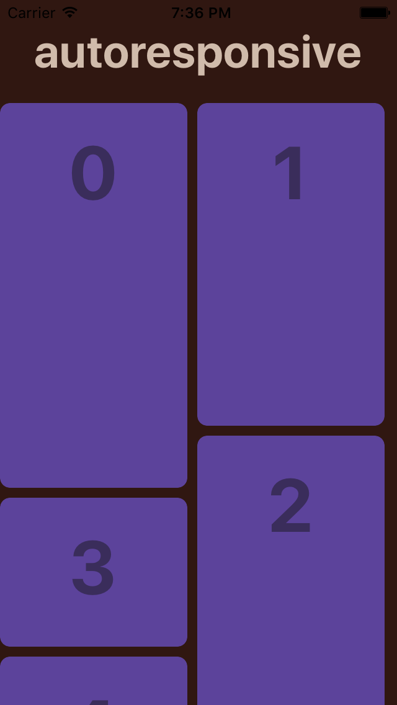
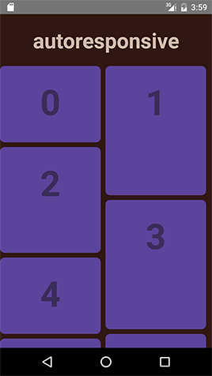

# autoresponsive_react_native_sample

Auto responsive grid layout library for [ReactNative](https://facebook.github.io/react-native/).

## CI

| Platform   | Status                                          |  Repo              |
| ---------- | ----------------------------------------------- | ------------------ |
| iOS        | [![build status][travis-image-0]][travis-url-0] | [autoresponsive_react_native_sample](https://github.com/xudafeng/autoresponsive_react_native_sample)                       |
| Android    | [![build status][travis-image-1]][travis-url-1] | [autoresponsive_react_native_sample_android_ci](https://github.com/xudafeng/autoresponsive_react_native_sample_android_ci) |

[travis-image-0]: https://img.shields.io/travis/xudafeng/autoresponsive_react_native_sample.svg?style=flat-square
[travis-url-0]: https://travis-ci.org/xudafeng/autoresponsive_react_native_sample
[travis-image-1]: https://img.shields.io/travis/xudafeng/autoresponsive_react_native_sample_android_ci.svg?style=flat-square
[travis-url-1]: https://travis-ci.org/xudafeng/autoresponsive_react_native_sample_android_ci

## Run

```bash
$ react-native run-android
```

## ScreenShot

Screenshots of iOS & Android which generated from automation test.

 

<!-- GITCONTRIBUTOR_START -->

## Contributors

|[<br/><sub><b>xudafeng</b></sub>](https://github.com/xudafeng)<br/>|[<br/><sub><b>ziczhu</b></sub>](https://github.com/ziczhu)<br/>
| :---: | :---: |


This project follows the git-contributor [spec](https://github.com/xudafeng/git-contributor), auto upated at `Thu Apr 05 2018 23:08:19 GMT+0800`.

<!-- GITCONTRIBUTOR_END -->

## License

MIT Licensed. Copyright (c) xdf 2015.
